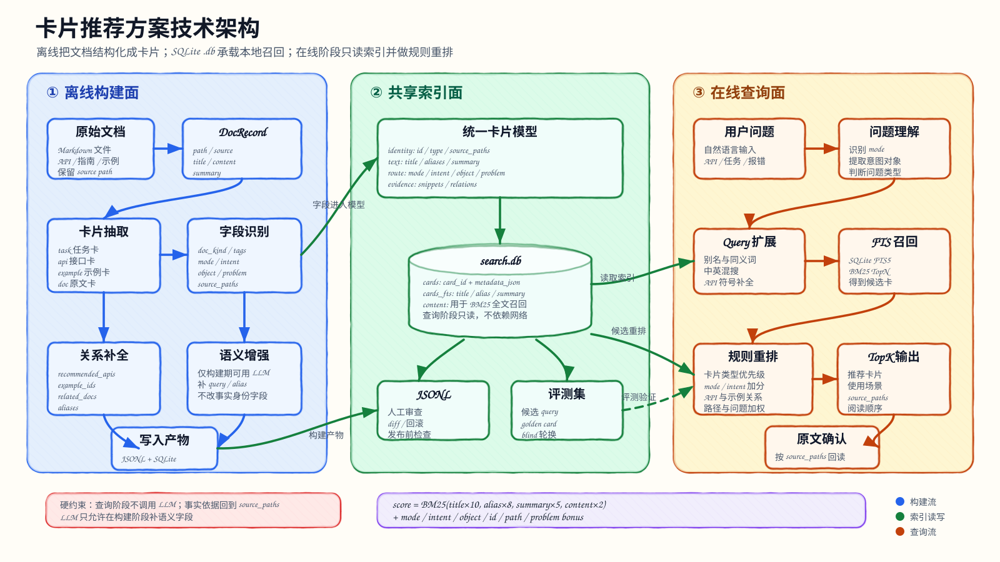

# 卡片推荐方案快速上手

本文面向第一次接触 `cangjie-harmonyos-doc-search` 的维护者和使用者，说明卡片推荐方案是什么、为什么这样做、如何构建、如何查询，以及常见术语的含义。

## 一句话说明

卡片推荐方案不是直接对文档全文做关键词搜索，而是先把原始文档整理成几类结构化“卡片”，查询时再根据用户意图推荐最相关的任务、API、示例和原文位置。

这样做的目标是：

- 用户问“我要做什么”时，优先推荐实现任务和相关 API。
- 用户问“某个组件/接口怎么用”时，优先推荐 API 卡。
- 用户问“有没有代码示例”时，优先推荐示例卡。
- 用户问题比较模糊或需要读原文时，再推荐文档卡。

## 核心原理

整体链路分成两个阶段：

```text
维护阶段：原始文档 -> 构建脚本 -> 卡片索引
查询阶段：用户问题 -> 意图理解 -> 卡片检索 -> 推荐结果
```

维护阶段由 `cangjie-harmonyos-doc-search-maintenance` 负责。构建脚本读取 `cangjie-harmonyos-doc-search/docs/` 下的文档，生成结构化索引并写入 `cangjie-harmonyos-doc-search/doc-card/index/`。

查询阶段由 `cangjie-harmonyos-doc-search` 负责。用户态只读本地索引，不调用 LLM，不要求用户配置 `url/key/model`。

架构总览：



## 技术原理

卡片推荐方案的核心是“先结构化，再检索”。它把原始 Markdown 文档转换成四类稳定对象，再围绕这些对象做召回和排序。

### 构建阶段做了什么

构建脚本 `builder/build_index_v3.py` 不是简单把 Markdown 转 JSON。它会先把文档整理成统一的中间对象，再生成四类卡片，最后写成可查询的 JSONL 和 SQLite FTS 索引。

#### 1. 文档扫描：Markdown -> DocRecord

入口函数是 `discover_docs(DOCS_DIR)`。它会遍历配置的文档源：

```text
harmonyos-6.0.2-15k
lang-features
std
stdx
tools
```

每个非空 Markdown 文件会被转成一个 `DocRecord`：

```text
path     相对 docs/ 的路径
source   文档来源，例如 harmonyos-6.0.2-15k
title    第一行 Markdown 标题；没有标题时用文件名
content  原文正文
summary  从正文截取/归纳出的短摘要
```

这里的 `path` 很重要。后续所有卡片的 `source_paths` 都引用这个相对路径，用户回答时再用：

```text
cangjie-harmonyos-doc-search/docs/<source_path>
```

定位原文。

#### 2. 示例卡生成：路径和标题识别示例

`find_examples(records)` 会根据路径和标题里的示例信号生成 example card。

典型信号包括：

```text
示例
example
demo
```

示例卡会保存：

- `example_id`
- `title`
- `scenario`
- `related_apis`
- `related_tasks`
- `source_paths`
- `tags`

其中 `related_apis` 会根据高价值 API 配置里的路径关键词推断。例如示例路径落在 `Refresh` 文档下，就会关联到 `arkui.refresh`。

#### 3. API 卡生成：人工高价值配置 + 自动发现合并

API 卡不是只靠一套规则生成，而是两路合并：

```text
HIGH_VALUE_API_MAP curated cards
  + discover_api_cards(records, examples)
  -> merge_api_cards(...)
```

第一路是 `HIGH_VALUE_API_MAP`。它维护高频组件和 API 的稳定身份，例如：

```text
arkui.list
arkui.refresh
arkui.web
network.http
storage.preferences
```

这一路的作用是保证高价值对象有稳定的 `api_id`、别名、相关 API 和优先 source paths。

第二路是 `discover_api_cards()` 自动发现。它根据路径判断文档是不是 API 参考：

```text
/func_       -> function
/class_      -> class
/interface_  -> interface
/enum_       -> enum
组件属性      -> property
组件事件      -> event
基础类型定义  -> type
```

然后从标题或文件名中抽取 API 名，比如：

```text
func loadUrl(...) -> loadUrl
class WebviewController -> WebviewController
enum GrantStatus -> GrantStatus
```

最后 `merge_api_cards()` 会按两类身份去重合并：

- `source_paths` 是否重合
- `(module, kind, name)` 是否一致

这样既保留人工维护的高价值 API 稳定入口，又能覆盖大量普通 class/function/enum 文档。

#### 4. 任务卡生成：高频开发意图映射

任务卡来自 `HIGH_VALUE_TASKS`，它不是从任意句子里自动抽象出来的，而是维护了一组高频开发任务。

每个任务配置通常包含：

```text
task_id
title
aliases
domain
intent
when_to_use
recommended_apis
optional_apis
path_keywords
example_keywords
tags
```

构建时会用 `path_keywords` 从文档中找相关原文，用 `example_keywords` 从示例卡里找关联示例。

所以任务卡本质上是“开发意图 -> 推荐 API/示例/文档”的桥接层。例如：

```text
下拉刷新 -> Refresh + List + 对应示例文档
基础滑动列表 -> List + ListItem + LazyForEach
WebView 加载网页 -> Web + WebviewController.loadUrl
```

#### 5. 文档卡生成：每篇原文都有可检索入口

`build_doc_cards(records)` 会给每个 `DocRecord` 生成 doc card。

它会根据路径推断 `doc_kind`：

```text
.overview.md / .abstract.md -> overview / abstract
示例代码 / example / demo    -> example
/class_ / /func_ / /enum_    -> reference
其他                         -> article
```

文档卡的价值是兜底：当 task/api/example 没有覆盖时，仍然能把用户带到最接近的原始文档。

#### 6. 关系挂接：让卡片之间能互相推荐

卡片不是孤立的。构建阶段会建立一些轻量关系：

- task card 里保存 `recommended_apis` 和 `example_ids`
- api card 里保存 `related_apis` 和 `example_ids`
- example card 里保存 `related_apis` 和 `related_tasks`

`attach_example_relations(tasks, examples)` 会把示例反向挂回任务。查询时如果先命中任务卡，就能继续推荐相关 API 和示例，而不需要再做复杂推理。

#### 7. 别名表生成：提升自然语言召回

`build_aliases(tasks, apis)` 会生成 `aliases.json`。

来源包括：

- task 的 `title` 和 `aliases`
- api 的 `name` 和 `aliases`
- 维护者手写的常见中文/英文同义词

示例：

```json
{
  "滑动列表": ["List", "列表", "可滚动列表"],
  "下拉刷新": ["Refresh", "刷新组件"],
  "网页": ["Web", "Webview", "网页组件"]
}
```

查询阶段会先用这个表扩展用户 query，所以用户不用精确记住 API 名。

#### 8. 元数据补齐：让卡片可检索、可排序

生成卡片时会调用 `enrich_card_metadata(...)` 补通用字段，例如：

- `intent_types`
- `primary_objects`
- `user_queries`
- `semantic_aliases`
- `problem_signals`
- `priority`
- `confidence`
- `needs_review`

在 `rule` 模式下，这些字段主要来自规则、路径、标题、标签和内置映射。在 `rule+llm` 模式下，会再调用 LLM 补更自然的摘要、问法、语义别名、适用/不适用场景等。

关键约束是：LLM 只能补语义字段，不能改卡片主键、API 原始名称、方法签名、`source_paths` 这类身份字段。

#### 9. 写盘：可读 JSONL + 可查 SQLite

构建完成后会写两类产物。

第一类是可读、可审计的 JSONL：

```text
tasks.jsonl
apis.jsonl
examples.jsonl
docs.jsonl
aliases.json
manifest.json
```

第二类是查询用的 SQLite：

```text
search.db
```

JSONL 方便人工 review、diff 和调试；`search.db` 负责查询时快速召回。

#### 10. 评测集生成：每次构建自带回归素材

构建阶段还会生成：

```text
doc-card/evals/search/eval_queries_full.jsonl
```

它由 `write_full_eval_queries(...)` 生成，会为 task/api/example/doc 四类卡片构造多类 query：

```text
exact
natural
semi-structured
error-driven
exploration
```

这套评测集用于后续发布门禁，检查新索引是否还能命中预期 `source_paths`。

简化后的数据流如下：

```text
Markdown 文档
  -> DocRecord(path, title, content, source)
  -> examples
  -> curated API cards + discovered API cards
  -> task cards + doc cards
  -> attach relations + build aliases
  -> optional rule+llm enrichment
  -> tasks/apis/examples/docs JSONL + aliases.json + search.db + eval queries
  -> search_v3.py 查询
```

### 查询阶段做了什么

查询脚本 `doc-card/search_v3.py` 主要做四件事：

1. **理解问题**：把用户输入归类为功能诉求、API 查询、示例查询、文档查询或排错查询。
2. **选择卡片类型**：例如 `--mode example` 会优先查示例卡，同时补相关 API 和任务。
3. **召回候选**：使用本地 SQLite 索引、别名、语义别名、用户问法、原文路径等字段召回候选卡片。
4. **重排结果**：根据意图匹配、对象匹配、路径信号、别名命中、排错信号等规则给候选加权排序。

查询结果不是最终答案，而是“可信入口”。回答问题时仍要读 `source_paths` 对应原文，避免只凭卡片摘要生成细节。

### 召回是怎么做的

召回不是只拿用户原句去搜。实际会先扩展 query，再用 SQLite FTS5 做第一轮候选召回。

核心步骤：

1. **别名扩展**：如果 query 命中 `aliases.json` 中的主名或别名，会把同组别名一起加入查询。例如用户输入“滑动列表”，会扩展出 `List`、`List 组件` 等同义说法。
2. **领域扩展**：根据问题理解结果里的 `primary_objects` 追加领域词。例如识别到 `refresh`、`web`、`permission` 后，会补相关 API 名、模块名或中文术语。
3. **动作扩展**：对一些典型动作补精确词。例如“运行时申请权限”会补 `requestPermissionsFromUser`，“WebView 执行 JS”会补 `runJavaScript`。
4. **分词转换**：`tokenize_query()` 会把英文/API 标识符、数字、中文片段拆成 FTS 可用 token。中文会进一步按字拆分，降低中文分词依赖。
5. **FTS 召回**：在 `cards_fts` 上执行 `MATCH`，每种卡片类型最多先取 `limit * 20` 个候选，后面再重排。

简化逻辑如下：

```text
用户 query
  -> normalize_query(别名扩展)
  -> expand_query_for_understanding(领域词/动作词扩展)
  -> tokenize_query(转成 FTS MATCH 表达式)
  -> cards_fts MATCH
  -> 候选卡片
```

这意味着召回更像“多路信号合并”，不是单字段关键词命中。

### 排序是怎么做的

排序分两层：先用 SQLite FTS 的 BM25 得到基础分，再用业务规则重排。

第一层是 FTS 基础分：

```sql
bm25(cards_fts, 10.0, 8.0, 5.0, 2.0)
```

对应字段权重是：

```text
title   10.0
aliases  8.0
summary  5.0
content  2.0
```

也就是说，命中标题和别名比命中长内容更重要。FTS5 的 `bm25` 分数越小越相关，代码里会取负数再加额外 bonus。

第二层是业务重排，主要看这些信号：

- **模式匹配**：用户偏好是 `example`，示例卡加分；偏好是 `api`，API 卡加分。
- **意图匹配**：用户意图命中卡片的 `intent_types` 加分。
- **对象匹配**：用户问题中的 `primary_objects` 与卡片的 `primary_objects` 重合加分。
- **标识符命中**：API 名、方法名、错误码、属性名等命中 `title/name/aliases/source_paths` 加分。
- **排错信号**：query 命中卡片 `problem_signals` 加分。
- **路径意图加权**：某些高价值路径有额外规则，例如 `loadUrl`、`rawfile`、`权限拒绝`、`相机错误码` 等。
- **优先级字段**：卡片自身的 `priority` 会参与最终分。
- **不相关惩罚**：如果用户明确问某类对象，而卡片对象完全不匹配，会扣分。

最终结果不是简单 BM25 排序，而是：

```text
最终分 = FTS 基础分 + alias/title bonus + intent/object/identifier/path/problem/priority 等业务加权
```

这也是为什么卡片字段质量很重要：`intent_types`、`primary_objects`、`semantic_aliases`、`problem_signals` 会直接影响排序。

### search.db 的作用

`search.db` 是查询阶段的快速召回索引，使用 SQLite 存两类表：

```sql
CREATE TABLE cards (
  card_type TEXT,
  card_id TEXT PRIMARY KEY,
  title TEXT,
  aliases TEXT,
  summary TEXT,
  content TEXT,
  paths_json TEXT,
  metadata_json TEXT
);

CREATE VIRTUAL TABLE cards_fts USING fts5(
  title, aliases, summary, content, content=''
);
```

两张表分工不同：

- `cards`：保存完整卡片元数据，尤其是 `metadata_json`。查询命中后要从这里还原完整卡片。
- `cards_fts`：保存可全文检索字段，用 FTS5 做快速 `MATCH` 和 BM25 排名。

构建时，每张卡片会写入两份信息：

```text
cards:
  card_type / card_id / title / aliases / summary / paths_json / metadata_json

cards_fts:
  title / aliases / summary / content
```

其中 `content` 是综合检索字段，会拼入多种信号：

- 标题
- 摘要
- aliases
- user_queries
- semantic_aliases
- when_to_use / when_not_to_use
- intent_types
- primary_objects
- problem_signals
- recommended_apis / related_apis
- tags
- source_paths

因此 `search.db` 的作用不是保存“最终答案”，而是把卡片压成一个适合本地快速召回的索引。JSONL 文件保留可读、可审计的卡片数据；`search.db` 负责查询性能和 BM25 初筛。

### 为什么分四层卡片

同一份文档可能同时能回答不同问题。比如 `Refresh` 文档既能回答“下拉刷新用什么组件”，也能回答“代码怎么写”，还可以作为原文依据。

如果只把它当成一篇文档，查询系统很难知道用户真正需要哪种入口。拆成四层后：

- `task` 负责功能目标。
- `api` 负责事实对象和接口。
- `example` 负责代码入口。
- `doc` 负责原文兜底和探索。

这种设计让查询结果更贴近开发者的真实工作流。

## 四类卡片

### 任务卡 task card

回答“我要实现什么功能”。

示例：

- 下拉刷新
- 基础滑动列表
- WebView 加载网页
- 运行时申请权限

适合处理功能诉求，例如“做一个带下拉刷新的列表页”。

### API 卡 api card

回答“应该用哪个组件、类、函数、属性、事件或枚举”。

示例：

- `List`
- `Refresh`
- `WebviewController.loadUrl`
- `requestPermissionsFromUser`

适合处理明确 API 查询、构建报错、参数/属性/事件问题。

### 示例卡 example card

回答“代码怎么写”。

示例卡通常指向具体的示例文档，适合在生成代码前补一次查询，确认真实示例写法。

### 文档卡 doc card

回答“原始文档在哪里、这篇文档大概讲什么”。

文档卡适合探索性问题、原文定位、排错背景补充，以及任务/API/示例卡无法覆盖的内容。

## 卡片示例

下面是简化后的示例，真实卡片字段会更多。

### 任务卡示例

```json
{
  "task_id": "ui.refresh.basic",
  "title": "下拉刷新",
  "summary": "为滚动列表增加下拉刷新交互。",
  "aliases": ["下拉刷新", "刷新列表", "pull to refresh"],
  "recommended_apis": ["arkui.refresh", "arkui.list"],
  "intent_types": ["feature_implementation"],
  "primary_objects": ["refresh", "list"],
  "source_paths": [
    "harmonyos-6.0.2-15k/cj-scroll-swipe-refresh/Refresh/.overview.md",
    "harmonyos-6.0.2-15k/cj-scroll-swipe-refresh/Refresh/示例代码/示例1默认刷新样式.md"
  ]
}
```

这类卡片适合回答“我要做一个下拉刷新列表页，用什么能力”。

### API 卡示例

```json
{
  "api_id": "arkui.refresh",
  "name": "Refresh",
  "summary": "可以进行页面下拉操作并显示刷新动效的容器组件。",
  "aliases": ["Refresh", "下拉刷新组件"],
  "kind": "component",
  "related_apis": ["arkui.list", "arkui.scroll"],
  "intent_types": ["api_lookup", "feature_implementation"],
  "primary_objects": ["refresh"],
  "source_paths": [
    "harmonyos-6.0.2-15k/cj-scroll-swipe-refresh/Refresh/组件属性.md",
    "harmonyos-6.0.2-15k/cj-scroll-swipe-refresh/Refresh/组件事件_2more.md"
  ]
}
```

这类卡片适合回答“Refresh 是什么、有哪些属性事件、和 List 怎么配合”。

### 示例卡示例

```json
{
  "example_id": "example.refresh.default-style",
  "title": "示例1默认刷新样式",
  "summary": "演示 Refresh 容器的基础下拉刷新写法。",
  "related_apis": ["arkui.refresh"],
  "intent_types": ["example_lookup"],
  "primary_objects": ["refresh"],
  "source_paths": [
    "harmonyos-6.0.2-15k/cj-scroll-swipe-refresh/Refresh/示例代码/示例1默认刷新样式.md"
  ]
}
```

这类卡片适合在写代码前使用，用来确认真实示例和 import 写法。

### 文档卡示例

```json
{
  "doc_id": "doc.refresh.overview",
  "title": "Refresh",
  "summary": "Refresh 组件的概览、属性、事件和示例入口。",
  "source": "harmonyos-6.0.2-15k",
  "doc_kind": "overview",
  "intent_types": ["reference", "navigation"],
  "primary_objects": ["refresh"],
  "source_paths": [
    "harmonyos-6.0.2-15k/cj-scroll-swipe-refresh/Refresh/.overview.md"
  ]
}
```

这类卡片适合快速定位原文入口，或在 task/api/example 结果不足时兜底。

### 怎么读一张卡

拿到卡片后优先看这些字段：

- `title/name`：推荐对象是什么。
- `summary`：它大概解决什么问题。
- `intent_types`：它适合哪类问题。
- `primary_objects`：它主要涉及哪些对象。
- `related_apis/recommended_apis`：下一步可能要查什么。
- `source_paths`：最终事实依据在哪里。

## 为什么不用全文搜索

全文搜索能找到包含关键词的文档，但很难区分用户真正想要的是“功能方案”“API 说明”“示例代码”还是“原始资料”。

卡片方案把文档提前整理成可检索对象，并给每张卡片补充：

- 标题和别名
- 摘要
- 适用场景
- 不适用场景
- 用户可能会怎么问
- 相关 API 或相关任务
- 原文路径

因此查询结果更接近“推荐答案入口”，而不只是“包含某个词的文件列表”。

## 优势

- **查询稳定**：用户态只读本地索引，不依赖远端服务。
- **结果可解释**：每个结果都能回到 `source_paths` 对应的原始文档。
- **适合开发场景**：能区分功能、API、示例、排错等不同意图。
- **构建和查询分离**：构建脚本放在 maintenance，用户态 skill 只负责查询。
- **支持离线增强**：维护阶段可选 `rule+llm` 补充语义字段，查询阶段仍不调用 LLM。
- **方便评测**：构建产物和评测集都能进入发布门禁，避免凭感觉发布。

## 劣势和边界

- **需要定期重建**：文档路径或内容变化后，需要重新构建索引。
- **首次构建成本较高**：`rule+llm` 会调用外部 LLM，耗时和成本都高于纯规则构建。
- **依赖卡片质量**：卡片字段不准会影响召回和排序。
- **不是最终答案生成器**：卡片只推荐入口，最终回答仍要读取原文并组织。
- **不适合无文档依据的问题**：如果原始文档没有覆盖，卡片也不能凭空提供事实。

## 构建方式

在仓库根目录执行：

```bash
python .agents/skills/cangjie-harmonyos-doc-search-maintenance/builder/build_index_v3.py \
  --mode rule
```

默认输出到：

```text
.agents/skills/cangjie-harmonyos-doc-search/doc-card/index/
```

常见产物：

```text
manifest.json
tasks.jsonl
apis.jsonl
examples.jsonl
docs.jsonl
aliases.json
search.db
```

如果要输出到临时目录做验证：

```bash
python .agents/skills/cangjie-harmonyos-doc-search-maintenance/builder/build_index_v3.py \
  --mode rule \
  --index-dir /tmp/cangjie-index-rule
```

## rule 和 rule+llm 的区别

### rule

纯规则构建，速度快，不需要外部模型。

主要负责：

- 扫描文档路径
- 提取标题
- 识别文档类型
- 生成基础卡片
- 写入 JSONL 和 SQLite 索引

适合快速验证、基础发布和本地 smoke test。

### rule+llm

在规则结果基础上，用离线 LLM 补充语义字段。

主要补充：

- `summary`
- `user_queries`
- `semantic_aliases`
- `intent_types`
- `primary_objects`
- `when_to_use`
- `when_not_to_use`
- `problem_signals`
- `tags`

适合需要提高自然语言召回、跨表达方式召回和排错查询召回的场景。

示例：

```bash
OPENAI_BASE_URL="..." \
OPENAI_API_KEY="..." \
OPENAI_MODEL="..." \
OPENAI_TEMPERATURE="0" \
python .agents/skills/cangjie-harmonyos-doc-search-maintenance/builder/build_index_v3.py \
  --mode rule+llm \
  --index-dir /tmp/cangjie-index-llm \
  --llm-card-types task,api,example,doc \
  --llm-concurrency 24 \
  --llm-cache-dir /tmp/cangjie-llm-cache
```

注意：`rule+llm` 只在维护构建阶段调用 LLM，用户查询阶段不调用 LLM。

## 使用方式

### 直接查卡片

```bash
python .agents/skills/cangjie-harmonyos-doc-search/doc-card/search_v3.py \
  "List 下拉刷新示例" \
  --mode example \
  --json \
  --limit 5
```

常用模式：

```text
auto     自动判断
task     功能方案优先
api      API/组件/属性/事件优先
example  示例代码优先
doc      原始文档优先
```

### 通过统一入口查询

```bash
python .agents/skills/cangjie-harmonyos-doc-search/unified_search.py \
  "List 下拉刷新示例" \
  --engine card \
  --json \
  --limit 5
```

`unified_search.py` 是日常入口。`--engine card` 使用卡片检索；默认也可以与图谱能力融合。

## 推荐使用流程

普通开发问题按这个顺序处理：

1. 先判断用户是问功能、API、示例还是排错。
2. 用 `search_v3.py` 或 `unified_search.py` 查本地索引。
3. 优先读 Top 1-2 的 `source_paths` 原文。
4. 回答时引用卡片命中的 API、示例和注意事项。
5. 不要只凭模型记忆编造不存在的 API。

典型选择：

```text
“我要做一个列表页”         -> --mode task
“List 有哪些属性”           -> --mode api
“下拉刷新怎么写代码”        -> --mode example
“报错 cannot convert ...”   -> --mode auto 或 --mode api
“这块文档在哪里”            -> --mode doc
```

## 维护发布流程

文档变更后建议走完整维护链路：

```bash
cd .agents/skills/cangjie-harmonyos-doc-search-maintenance

python scripts/build_doc_manifest.py \
  --output /tmp/doc_manifest_current.json

python builder/build_index_v3.py \
  --mode rule \
  --index-dir /tmp/cangjie-index-rule

python scripts/run_release_eval.py \
  --index-dir /tmp/cangjie-index-rule \
  --output-dir /tmp/cangjie-release-eval
```

如果评测通过，再考虑同步到正式：

```text
.agents/skills/cangjie-harmonyos-doc-search/doc-card/index/
```

发布前不要绕过评测直接覆盖正式索引。

## 常见术语

### 卡片

从原始文档整理出来的结构化检索对象。卡片不是新知识，必须能追溯到原始文档。

### source_paths

卡片关联的原始文档路径。回答具体 API 或代码前，应读取这些路径对应的原文。

### alias

别名。用于把“列表”“滑动列表”“List 组件”等不同说法映射到同一对象。

### semantic_aliases

语义别名。通常由 `rule+llm` 补充，用于覆盖更自然的问法。

### user_queries

用户可能真实输入的问法。用于提升自然语言查询召回。

### primary_objects

卡片主要涉及的对象，例如 `list`、`refresh`、`web`、`permission`。

### intent_types

意图类型，例如 API 查询、示例查询、排错、概念解释等。

### problem_signals

排错信号，例如错误码、报错关键词、异常现象。用于排错类查询召回。

### manifest.json

索引构建清单，记录构建模式、生成时间、卡片数量、入口脚本等信息。

### search.db

SQLite 检索库，查询阶段主要依赖它做快速召回和排序。

### eval set

评测集。用于判断索引是否能命中预期文档路径。

### blind set

盲测集。用于尽量客观地评估新索引效果；一旦用它调过规则，就应降级为回归集。

## 常见问题

### 查询提示索引不完整

先确认 LFS 文件是否拉取完整：

```bash
ls -lh .agents/skills/cangjie-harmonyos-doc-search/doc-card/index/docs.jsonl
ls -lh .agents/skills/cangjie-harmonyos-doc-search/doc-card/index/search.db
```

如果文件只有一百多字节，通常是 LFS pointer，需要执行：

```bash
git lfs pull
```

也可以重新构建：

```bash
python .agents/skills/cangjie-harmonyos-doc-search-maintenance/builder/build_index_v3.py \
  --mode rule
```

### 查不到想要的结果

优先检查：

- 查询词是否过泛。
- 是否选错模式，例如示例问题却用了 `--mode api`。
- `source_paths` 指向的原文是否仍存在。
- 文档是否新增但索引没有重建。

### 什么时候用图谱而不是卡片

卡片适合精确 API、示例、错误码和高频任务。图谱更适合组合关系、跨概念推理和架构鸟瞰。日常可以通过 `unified_search.py` 统一入口使用。

## 快速检查清单

构建后最少做三件事：

```bash
python .agents/skills/cangjie-harmonyos-doc-search-maintenance/builder/build_index_v3.py --help

python .agents/skills/cangjie-harmonyos-doc-search/doc-card/search_v3.py \
  "List 下拉刷新示例" \
  --mode example \
  --json \
  --limit 2

python .agents/skills/cangjie-harmonyos-doc-search/unified_search.py \
  "List 下拉刷新示例" \
  --engine card \
  --json \
  --limit 2
```

如果三条都正常，说明构建脚本、卡片索引和统一查询入口基本可用。
